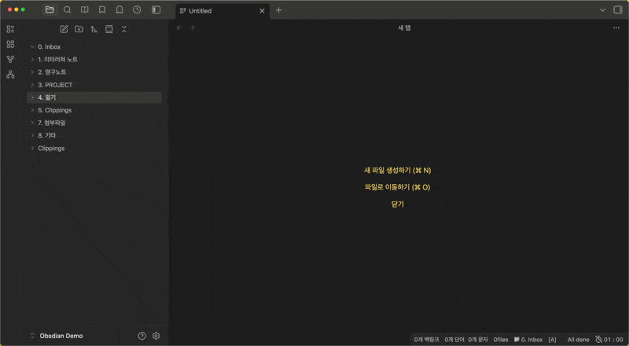

# ObsiMap

Create keyboard-centric mind maps in Obsidian with wiki-linked notes, drag-and-drop editing, and Markdown export.


## Overview

ObsiMap adds a dedicated mind map view to your vault. Build hierarchies with the keyboard, link nodes to existing notes, reorganize with drag-and-drop, and export outlines or merged documents when you are ready to publish.



## Features

- **Mind map editing** — Create, rename, delete, collapse, and reorder nodes; multi-select; undo (`Ctrl/Cmd+Z`).
- **Keyboard-first workflow** — Navigate and edit without leaving the keyboard; customizable hotkeys in settings.
- **Note integration** — Link nodes with `[[wikilinks]]`, search and attach notes, create notes from nodes, open linked notes.
- **Drag-and-drop** — Reorder siblings, reparent nodes, and drop external notes onto the map.
- **Markdown import/export** — Import the active note’s list structure; export the map as a Markdown outline.
- **Full note export** — Compile linked note content into one Markdown document (optional YAML stripping).
- **`.mindmap` files** — Store maps as vault files with a JSON data block for persistence and version control.

## Getting started

1. Enable **ObsiMap** in **Settings → Community plugins**.
2. Click the **network** ribbon icon or create/open a `.mindmap` file.
3. Select the map canvas so keyboard shortcuts apply (click the background once).
4. Use `Tab` / `Enter` to add nodes, arrow keys to move selection, and `Shift+Enter` to rename.

### Toolbar (floating)

| Button | Action |
| --- | --- |
| Import markdown | Build a map from the active note’s list items |
| Export markdown | Save the map as a Markdown outline |
| Full note | Export merged content from linked notes |

Pan with click-drag on the canvas; zoom with the mouse wheel.

## Default hotkeys

| Action | Default |
| --- | --- |
| Create child | `Tab` |
| Create sibling | `Enter` |
| Edit node text | `Shift+Enter` |
| Delete node | `Delete` |
| Search and link note | `Shift+Ctrl+Enter` (macOS: `Shift+Cmd+Enter`) |
| Create note from node | `Ctrl+Shift+N` (macOS: `Cmd+Shift+N`) |
| Open linked note | `Ctrl+Shift+L` or double-click |
| Toggle collapse | `Ctrl+/` |
| Navigate | Arrow keys |
| Reorder / promote / demote | `Shift` + Arrow keys |
| Undo | `Ctrl/Cmd+Z` |

All shortcuts can be changed under **Settings → ObsiMap**.

## Commands

| Command | Description |
| --- | --- |
| **Import current note** | Converts the active Markdown note’s list structure into a mind map |

## Settings

| Setting | Description |
| --- | --- |
| Export folder | Default folder for new `.mindmap` files and exports |
| Theme | Map color theme |
| Hotkeys | Per-action keyboard bindings |
| Strip metadata | Remove YAML frontmatter when exporting full notes |
| Hover preview | Show note preview on linked nodes |
| Max node length | Truncate long labels in the view |
| Node style | Pill or rectangle node shape |

## Installation

### Community plugins (recommended)

After ObsiMap is listed in the directory:

1. Open **Settings → Community plugins**.
2. Turn off **Restricted mode** if needed.
3. Search for **ObsiMap** and install.

### Manual install

1. Download `main.js`, `manifest.json`, and `styles.css` from the [latest release](https://github.com/Creative781/obsimap/releases).
2. Create `.obsidian/plugins/obsimap/` in your vault.
3. Copy the three files into that folder.
4. Enable the plugin under **Settings → Community plugins**.

### Beta (BRAT)

1. Install [BRAT](https://github.com/TfTHacker/obsidian42-brat).
2. **Add Beta plugin** → `https://github.com/Creative781/obsimap`.

## Development

Requires [Node.js](https://nodejs.org/) 16+.

```bash
git clone https://github.com/Creative781/obsimap.git
cd obsimap
npm install
npm run build
```

Copy `main.js`, `manifest.json`, and `styles.css` into your vault’s `.obsidian/plugins/obsimap/` folder and reload Obsidian.

See [CONTRIBUTING.md](CONTRIBUTING.md) for guidelines.

## Compatibility

- **Obsidian**: `1.4.14` and later (`minAppVersion` in `manifest.json`).
- **Desktop and mobile**: No Node.js-only APIs; `isDesktopOnly` is `false`.
- **Network**: The plugin does not send vault data to external servers. The settings tab may load a Buy Me a Coffee button image from `cdn.buymeacoffee.com` if you open plugin settings.

## Privacy

ObsiMap reads and writes files only through Obsidian’s vault APIs. Mind map data stays in your vault (`.mindmap` files and exported Markdown). No analytics or third-party sync are included.

## Support

- [Report an issue](https://github.com/Creative781/obsimap/issues)
- [YouTube — Creative781](https://www.youtube.com/@creative781)
- [Blog](https://creative781.cafe24.com/)
<script type="text/javascript" src="https://cdnjs.buymeacoffee.com/1.0.0/button.prod.min.js" data-name="bmc-button" data-slug="creative781" data-color="#FFDD00" data-emoji=""  data-font="Cookie" data-text="Buy me a coffee" data-outline-color="#000000" data-font-color="#000000" data-coffee-color="#ffffff" ></script>

## License

MIT — see [LICENSE](LICENSE).

---

# ObsiMap (한국어)

옵시디안에서 키보드 중심 마인드맵을 만들고, 위키 링크로 노트를 연결하며, Markdown으로보낼 수 있는 플러그인입니다.

## 주요 기능

- **마인드맵 편집** — 노드 생성·이름 변경·삭제·접기·순서 변경, 다중 선택, 실행 취소
- **키보드 우선** — 설정에서 단축키 사용자 정의 가능
- **노트 연동** — `[[위키링크]]`, 노트 검색·연결, 노드에서 새 노트 생성, 연결 노트 열기
- **드래그 앤 드롭** — 형제 순서·부모 변경, 외부 노트 드롭
- **Markdown** — 현재 노트 목록 가져오기, 아웃라이너보내기, 연결 노트 통합(Full note)
- **`.mindmap` 파일** — 보관함에 맵 데이터 저장

## 시작하기

1. **설정 → 커뮤니티 플러그인**에서 ObsiMap 활성화
2. 리본의 **network** 아이콘 클릭 또는 `.mindmap` 파일 열기
3. 캔버스를 한 번 클릭해 포커스를 맞춘 뒤 단축키 사용

## 기본 단축키

| 기능 | 기본값 |
| --- | --- |
| 자식 노드 | `Tab` |
| 형제 노드 | `Enter` |
| 텍스트 편집 | `Shift+Enter` |
| 삭제 | `Delete` |
| 노트 검색·연결 | `Shift+Ctrl+Enter` |
| 노트 생성 | `Ctrl+Shift+N` |
| 노트 열기 | `Ctrl+Shift+L` 또는 더블 클릭 |
| 이동 | 방향키 |
| 순서/계층 변경 | `Shift` + 방향키 |

## 설치

### 커뮤니티 플러그인

승인 후 **설정 → 커뮤니티 플러그인**에서 **ObsiMap** 검색·설치.

### 수동 설치

1. [릴리즈](https://github.com/Creative781/obsimap/releases)에서 `main.js`, `manifest.json`, `styles.css` 다운로드
2. 보관함 `.obsidian/plugins/obsimap/`에 복사
3. 플러그인 활성화

### 베타 (BRAT)

`https://github.com/Creative781/obsimap`

<script type="text/javascript" src="https://cdnjs.buymeacoffee.com/1.0.0/button.prod.min.js" data-name="bmc-button" data-slug="creative781" data-color="#FFDD00" data-emoji=""  data-font="Cookie" data-text="Buy me a coffee" data-outline-color="#000000" data-font-color="#000000" data-coffee-color="#ffffff" ></script>

## 라이선스

MIT — [LICENSE](LICENSE) 참고.
